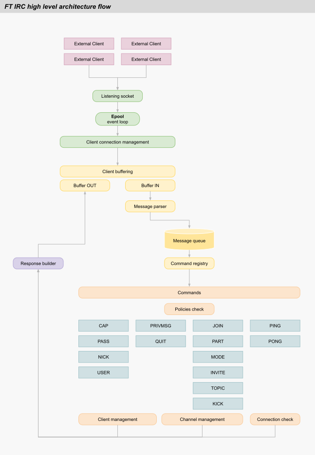

_This project has been created as part of the 42 curriculum by fpaglia, mweghofe._

# ft_irc

A lightweight, non-blocking IRC (Internet Relay Chat) server in C++98 with an event-driven bot client.

---

## Contents

- [Description](#description)
- [Instructions](#instructions)
- [Server (`ircserv`)](#server-ircserv)
- [Bonus: Bot (`ircbot`)](#bonus-bot-ircbot)
- [Architecture Overview](#architecture-overview)
- [Limitations](#limitations)
- [Resources](#resources)

---

## Description

**ft_irc** is a lightweight, **non-blocking IRC (Internet Relay Chat) server** implementation written in the **C++98 standard**. The project was developed as part of the 42 school curriculum to demonstrate architectural capabilities, deep understanding of network programming, the IRC protocol, and concurrent event handling.

The server (`ircserv`) supports multiple simultaneous clients through epoll-based I/O multiplexing, implementing the core features of the IRC protocol as defined in RFC 1459 and RFC 2812, while considering the draft for IRCv3. It is build on a clean, extensible architecture and manages the complete client lifecycle: authentication, nickname/username registration, channel management, operator privilege delegation, and direct/broadcast messaging.



The project also features a separate event-driven IRC bot (`ircbot`) as a bonus component, supporting interactive channel utilities and automated actions.

---

## Instructions

### Prerequisites

- **OS**: Linux (epoll is Linux-specific)
- **Compiler**: the project was developed using `clang++`version 12.0.1
- **Build tool**: GNU `make`
- **Reference IRC Client**: `irssi` (recommended) or `netcat` (`nc`)

### Compilation

Build the mandatory server (`ircserv`):
```bash
make
```

Build the bonus bot (`ircbot`):
```bash
make bonus
```

Build both executables:
```bash
make both
```

> **Note**: The build system enforces **one Make goal per invocation** (e.g. run `make clean && make`, not `make clean all`).

### Execution

#### 1. Server (`ircserv`)
```bash
./ircserv <port> <password>
```
- `<port>`: Port number between `1024` and `65535` (e.g. `6669`).
- `<password>`: Connection password. Must be at least **4 characters long** and include at least **one letter**, **one number**, and **one special character** (e.g. `1o.0`).

#### 2. Bot (`ircbot`)
```bash
./ircbot <server_ip_or_host> <port> <password>
```
- `<server_ip_or_host>`: Target IRC server hostname or IPv4 address (e.g. `127.0.0.1` or `localhost`).
- `<port>`: Target server port (e.g. `6669`).
- `<password>`: Server connection password (e.g. `1o.0`).

### Connecting to the Server

#### Using the Reference Client (`irssi`)

Connect directly from the command line:
```bash
irssi -c localhost -p 6669 -w 1o.0 -n mynick
```

Or from within an active `irssi` session:
```text
/connect localhost 6669 1o.0
```

#### Using `netcat` (`nc`)

Netcat connects with raw TCP and requires explicit CRLF (`\r\n`) line endings (`-C` flag):
```bash
nc -C 127.0.0.1 6669
```

Example valid registration and chat flow:
```text
PASS 1o.0
NICK alice
USER alice 0 * :Alice Wonderland
JOIN #lobby
PRIVMSG #lobby :Hello from netcat!
PART #lobby :Stepping out
QUIT :Bye!
```

### Makefile Targets

The Makefile includes dedicated convenience targets with preset defaults (`PORT=6669`, `PASSWORD=1o.0`, `HOST=localhost`, `NICK=BugDetector`):

| Target | Description |
|---|---|
| `all` / `build` | Compile `ircserv` in release mode |
| `bonus` | Compile `ircbot` in release mode |
| `run` | Build and run `ircserv` in the foreground |
| `runb` / `bot` | Build and run `ircbot` in the foreground |
| `both` | Compile both `ircserv` and `ircbot` |
| `both-run` | Launch `ircserv` in background and `ircbot` in foreground |
| `chat` | Launch `irssi` client connected to local preset |
| `nc` | Launch raw `netcat` session |
| `asan` / `asanb` | Build with AddressSanitizer (`-fsanitize=address -g3`) |
| `val` / `valb` | Run with Valgrind leak and file-descriptor checks |
| `both-val` | Run both server and bot under Valgrind |
| `clean` / `fclean` / `re` | Standard 42 cleaning and rebuild rules |

---

## Server (`ircserv`)

The server manages non-blocking network I/O through a single `epoll` instance, parsing and executing commands according to RFC 1459 / RFC 2812.

### Registered Commands

All core commands are registered through a policy-checked command registry:

- **Connection & Registration**: `PASS`, `NICK`, `USER`, `CAP` (handshake stub for `LS` and `END`), `QUIT`
- **Channel Operations**: `JOIN`, `PART`, `TOPIC`, `INVITE`, `KICK`, `MODE`
- **Messaging**: `PRIVMSG` (supports channels `#`/`&` and private users, comma-separated targets)
- **Liveness**: `PING`, `PONG`

### Channel Modes

Supported channel modes (`MODE <#channel> {[+|-]|o|i|t|k|l} [<args>]`):

- `+i` / `-i`: Invite-only channel flag
- `+t` / `-t`: Topic change restricted to channel operators
- `+k` / `-k`: Set or remove channel key (password)
- `+o` / `-o`: Grant or revoke channel operator status
- `+l` / `-l`: Set or remove maximum user limit

User MODE requests (`MODE <nick> +i`) return a compatibility reply (`221 UMODEIS`) so reference clients such as `irssi` can complete registration without errors.

### Operational Rules & Limits

- **I/O Model**: Strict single-threaded non-blocking `epoll` multiplexing; no `fork()`
- **Nickname validation**: Max 32 characters, no whitespace or punctuation (` .,*?!@`), cannot begin with `$`, `:`, `~`, `&`, `#`, `@`, `%`, `+`
- **Channel naming**: Must begin with `#` or `&`, length between 4 and 32 characters, alphanumeric characters plus `-` and `_`
- **Channel join limit**: Maximum 3 concurrent channels per client
- **Abuse prevention**: Maximum 5 concurrent connections per IP address
- **Spam prevention**: Disconnects clients exceeding 42 messages within 2 seconds
- **Heartbeat & Inactivity**: Periodic `PING` every 90 seconds; disconnects after unanswered ping
- **Message chunking**: Formats outgoing messages within the 512-byte RFC limit

For command syntax, parameters, error responses, and policy mechanics, see the [Server Documentation](docs/server.md).

---

## Bonus: Bot (`ircbot`)

The bonus executable `ircbot` is a separate client program designed to automate channel administration and interact with users.

### Bot Capabilities

- **Automatic Channel Setup**: Automatically registers on the server with nickname `Bot`, joins its home channel (`#ssot` — Single Source Of Truth), restricts topic modification (`+t`), and sets an informational topic.
- **Resilient Connection**: Connects using non-blocking sockets and `epoll`, automatically reconnecting with exponential backoff if the server goes down.
- **Auto-Welcome**: Greets users when they join channels where the bot resides.
- **Invite Handling**: Joins channels automatically when invited by users (`INVITE Bot #channel`).
- **Ping/Pong Handling**: Responds to server `PING` requests to maintain an active session.
- **Duplicate Prevention**: Gracefully stops if nickname `Bot` is already occupied (`433 ERR_NICKNAMEINUSE`).

### Bot Commands

Users trigger bot features via channel messages or private queries (`PRIVMSG`):

| Command | Usage | Description |
|---|---|---|
| `!help` | `!help` | Prints available commands and help overview |
| `!quote` | `!quote` | Returns a philosophical quote from 30 multilingual entries |
| `!mirror` | `!mirror` | Toggles message mirroring on or off |
| `!spam` | `!spam [<target>]` | Sends repeated messages (12x) to channel or specified user |

For full command details, arguments, and execution flows, see the [Bot Documentation](docs/bot.md).

---

## Architecture Overview

The system architecture separates protocol abstractions from low-level networking:

- **`Epoll` abstraction**: Encapsulates Linux kernel event notification.
- **`IServerCtrl` interface**: Decouples the command execution subsystem from internal server state.
- **Command & Policy pattern**: Every command couples a handler with reusable policy guards (`AlreadyRegisteredPlcy`, `ArgsLimitPlcy`).
- **Input/Output Buffering**: Per-client dynamic buffers manage partial TCP segments, CRLF packet aggregation, and outbound backpressure.
- **Shared abstractions**: The bonus `ircbot` reuses the server's `Epoll`, `Message`, and `CommandRegistry` core for consistent event handling.

For complete architectural details, lifecycle diagrams, and design trade-offs, see the [Architecture Document](docs/architecture.md).

---

## Limitations

- **Volatile storage**: In-memory state only; channels and registrations reset upon server restart.
- **Transport security**: Plaintext TCP/IP (no SSL/TLS).
- **Network scope**: IPv4 only; no server-to-server IRC daemon mesh (per 42 subject requirements).
- **Capability negotiation**: Limited to IRCv3 `CAP LS` and `CAP END` handshake compatibility.
- **Maximum clients**: Defaults to 50,000 clients (configurable via `MAX_CLIENTS`).

---

## Resources

### IRC Protocol References

- [RFC 1459](https://datatracker.ietf.org/doc/html/rfc1459) – Internet Relay Chat Protocol (original specification)
- [RFC 2812](https://datatracker.ietf.org/doc/html/rfc2812) – Internet Relay Chat: Client Protocol
- [RFC 2119](https://datatracker.ietf.org/doc/html/rfc2119) – Key words for use in RFCs to Indicate Requirement Levels
- [Modern IRC Client Protocol](https://modern.ircdocs.horse/) – Current IRC protocol specification and numeric reply standard
- [IRCv3 Specifications](https://ircv3.net/) – IRCv3 working group extensions (CAP negotiation)
- [IRC Help Security Guidelines](https://www.irchelp.org/security/) – IRC network security considerations

### System & C++ References

- `epoll(7)` – Linux kernel I/O event notification facility
- [cppreference.com](https://en.cppreference.com/) – C++ language and standard library reference (C++98)

### AI Usage Disclosure

In compliance with 42 curriculum documentation standards, artificial intelligence was utilized as follows:

- **Documentation & Structuring**: AI was used to draft, reorganize, and refine this README and the satellite documentation files in `docs/` (command reference, bot reference, architecture migration).
- **Protocol & Standard Reference**: AI served as an interactive query reference for RFC numeric reply codes, modern client handshake behaviors (specifically `irssi` connection flows), and standard C++98 library semantics.
- **Testing & Test Suites**: AI was used to build a testing suite around unit tests and automated `nc` (netcat) tests to validate socket handling, parsing, and edge cases (maintained on dedicated development branches and not merged into `main`).

All architectural design decisions (interface-driven command model, policy composition, client/channel lifecycle, buffer aggregation, and epoll integration) were authored, reviewed, and validated independently.
