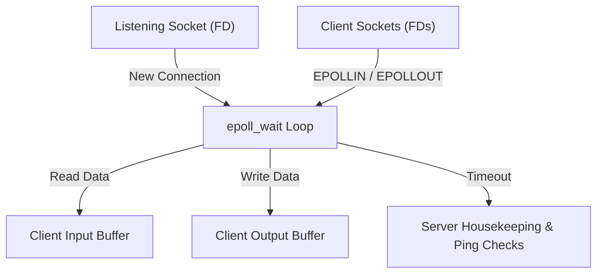

[Back to README](../README.md)

# ft_irc Architecture & Design Decisions

This document details the software architecture, design patterns, and internal workflows of the `ft_irc` server and `ircbot` client.

---

## Contents

- [Architectural Philosophy](#architectural-philosophy)
- [Single-Threaded Event-Driven Core (`epoll`)](#single-threaded-event-driven-core-epoll)
- [Interface-Driven Decoupling (`IServerCtrl`)](#interface-driven-decoupling-iserverctrl)
- [Command Pattern & Policy Composition](#command-pattern--policy-composition)
- [Message Ingestion & Parsing Pipeline](#message-ingestion--parsing-pipeline)
- [Client & Channel State Management](#client--channel-state-management)
- [Response Formatting & Chunking](#response-formatting--chunking)
- [Memory Management & RAII](#memory-management--raii)
- [Code Reuse in Bonus (`ircbot`)](#code-reuse-in-bonus-ircbot)

---

## Architectural Philosophy

The architecture of `ft_irc` is engineered around four guiding principles:

1. **Strict Non-Blocking I/O**: Eliminates thread synchronization issues and context-switching overhead by handling all client connections through a single event loop.
2. **Modular Decoupling**: Isolate command parsing and business rules from network transmission via abstract interfaces.
3. **Declarative Validation**: Enforce access and parameter preconditions before command execution using composable policy objects.
4. **Resilient Buffer Management**: Protect against packet fragmentation, slow network links, and rapid floods without dropping valid messages.

---

## Single-Threaded Event-Driven Core (`epoll`)

At the core of `ircserv` lies an `epoll`-based event multiplexer encapsulated within the `Epoll` class. 

### Epoll Wrapper
The `Epoll` class provides an isolated abstraction around the Linux system calls (`epoll_create`, `epoll_ctl`, `epoll_wait`):
- All sockets (server listening socket and client communication sockets) are configured with `O_NONBLOCK` via `fcntl`.
- Sockets register interest in `EPOLLIN` for inbound data and dynamically toggle `EPOLLOUT` when outbound buffers contain pending bytes.
- Errors and connection resets are caught early through `EPOLLERR` and `EPOLLHUP`.
- A 2000 ms timeout in `epoll_wait` ensures that server housekeeping (heartbeat pings, timeout evaluations, cleanup of departed clients) executes predictably even under idle network conditions.



---

## Interface-Driven Decoupling (`IServerCtrl`)

To avoid cyclical dependencies between command handlers and the `Server` class, command execution operates exclusively through the `IServerCtrl` pure virtual interface.

```cpp
class IServerCtrl
{
public:
    virtual ~IServerCtrl() {}
    virtual std::string getPassword() const = 0;
    virtual std::time_t getStartTime() const = 0;
    virtual void tryCompleteRegistration(Client*) const = 0;
    virtual Client* findClientByNick(const std::string&) const = 0;
    virtual void sendMessage(Client*, const std::string&) const = 0;
    virtual void broadcast(Channel*, Client*, const std::string&) const = 0;
    virtual void broadcast(Channel*, const std::string&) const = 0;
    virtual void broadcast(std::set<Client*>&, const std::string&) const = 0;
    virtual rfc addToChannel(Client*, const std::string&, const std::string&) = 0;
    virtual void removeClientFromChannel(Client*, Channel&, std::set<Client*>*) = 0;
    virtual void removeClientFromAllChannels(Client*, std::set<Client*>*) = 0;
    virtual Channel* getChannelByTitle(std::string) const = 0;
};
```

This abstraction ensures that:
- Individual command handlers (`cmd_join`, `cmd_privmsg`, `cmd_mode`, etc.) never inspect internal server data structures directly.
- The server implementation can be refactored or mocked without modifying protocol command implementations.

---

## Command Pattern & Policy Composition

IRC commands are implemented using the **Command Pattern** paired with a **Composable Policy** architecture.

### Policy Guards (`IPolicy`)
Before any command handler is invoked, it passes through an ordered chain of `IPolicy` evaluators. If any policy evaluates to false, the command is aborted and the policy generates the corresponding RFC numeric error reply:

- **`AlreadyRegisteredPlcy(bool expected)`**:
  - Enforces that pre-registration commands (like `PASS` and `USER`) can only be sent before registration is finalized (`false`).
  - Enforces that active IRC commands (like `JOIN`, `PRIVMSG`, `MODE`) require an authenticated and registered client (`true`).
- **`ArgsLimitPlcy(size_t min, size_t max)`**:
  - Verifies parameter bounds and issues `461 ERR_NEEDMOREPARAMS` if arguments fall below `min`.

### Declarative Registration
Commands are wired declaratively in `CommandRegistry`:

```cpp
Command *join = new Command("JOIN", cmd_join);
join->addPolicy(new AlreadyRegisteredPlcy(true));
join->addPolicy(new ArgsLimitPlcy(1, 2));
_commands[join->getName()] = join;
```

---

## Message Ingestion & Parsing Pipeline

TCP delivers a continuous byte stream without application-level message boundaries. A client can transmit multiple commands in a single packet, or split a single command across multiple network segments.

```mermaid
flowchart LR
  tcpStream["Raw TCP Stream"] --> buffer["Client Input Buffer"]
  buffer -->|"Split by CRLF"| parser["Message Parser"]
  parser --> msgQueue["Message Queue (_msgsQueue)"]
  msgQueue --> registry["CommandRegistry::execute()"]
  registry --> policies["Policy Verification"]
  policies --> handler["Command Handler"]
  handler --> response["Response Generator"]
  response --> outBuffer["Client Output Buffer"]
```



1. **Ingestion**: Raw bytes from `recv` are appended directly to the client's internal `_inBuffer`.
2. **Framing**: `_processInputBuffer` searches for CRLF (`\r\n`) terminators. Complete lines are extracted; partial fragments remain in the buffer until the next read event.
3. **Flood Detection**: The server monitors message frequency. If a client transmits more than 42 messages within 2.0 seconds, the connection is instantly flagged as abusive and closed.
4. **Structuring**: Each complete line is tokenized into a `Message` object containing prefix, command, parameters, and trailing payload.
5. **Batch Processing**: Enqueued messages are dispatched through `CommandRegistry::execute()`.

---

## Client & Channel State Management

The server maintains state via dedicated entities with clear lifecycle boundaries:

- **`Client`**:
  - Encapsulates socket file descriptor, registration state (`REG_NONE` to `REG_DONE`), nickname, username, realname, and hostname.
  - Maintains individual input and output string buffers.
  - Tracks membership in joined channels.
  - Maintains timestamp of the last received message for idle detection and keepalive checks.
- **`Channel`**:
  - Identified by case-insensitive titles starting with `#` or `&`.
  - Maintains a map of members to permission bitmasks (`US_BASIC`, `US_OPERATOR`).
  - Tracks channel modes (`CH_INVITE`, `CH_TOPIC`, `CH_PASSWORD`, `CH_LIMIT`).
  - Maintains invite whitelists and current user limits.
  - Automatically reassign channel operator rights if last operator leaves the channel.
  - Automatically destroyed when the last user leaves.
- **IP Registry (`_IPrecords`)**:
  - Tracks client instances by originating IP address.
  - Enforces `MAX_CLIENT_ON_IP` (5 connections max) to prevent denial-of-service attempts.

---

## Response Formatting & Chunking

The `Response` static class unifies RFC reply generation:

- **Numeric Replies**: Generates standardized replies with the server name prefix and numerical code (e.g. `:irc.CoolServ.42 001 <nick> :Welcome...`).
- **Regular Relays**: Formats user-to-user and channel broadcast messages with full user masks (`:<nick>!~<user>@<host> PRIVMSG <target> :<message>`).
- **Message Chunking (`chunkifyTrailing`)**: IRC strictly limits individual message packets to 512 bytes (including CRLF). When outgoing messages exceed this limit, the formatting pipeline safely segments long text across multiple lines at word boundaries without breaking message headers.

---

## Memory Management & RAII

Resource acquisition and lifetime management follow strict **RAII** principles:

- **Socket Ownership**: Socket file descriptors are wrapped in classes whose destructors guarantee deregistration from epoll and closure (`::close()`).
- **Entity Lifecycle**: `Server` solely owns all dynamically allocated `Client` and `Channel` instances. When a client departs, all channel memberships are updated, empty channels are destroyed, and client memory is reclaimed during the housekeeping cycle.
- **Signal Handling**: Standard POSIX signals (`SIGINT`, `SIGTERM`) are caught via atomic flags (`volatile std::sig_atomic_t _isAlive`). When a signal arrives, the event loop exits cleanly, closing all sockets and freeing all allocated memory without leaks. `SIGPIPE` is ignored to prevent process termination on writes to broken sockets.

---

## Code Reuse in Bonus (`ircbot`)

The bonus `ircbot` was designed to maximize architectural reuse from the core project rather than reimplementing networking logic:

- **Shared Components**:
  - `Epoll`: Provides identical non-blocking event multiplexing for the bot client.
  - `Message`: Reused for parsing server responses and incoming user queries.
  - `CommandRegistry`: Used with a specialized configuration (`registerBotCmds()`) to dispatch custom commands (`!help`, `!quote`, `!mirror`, `!spam`).
  - Argument Validators: `arg2ip`, `arg2port`, and `arg2password` are shared across both targets.
- **Compile-Time Separation**:
  - The build system uses conditional compilation (`#ifndef BONUS` vs `#else`) in `CommandRegistry-RegisterCmds.cpp` to separate server command dispatch from bot command dispatch without code duplication.
