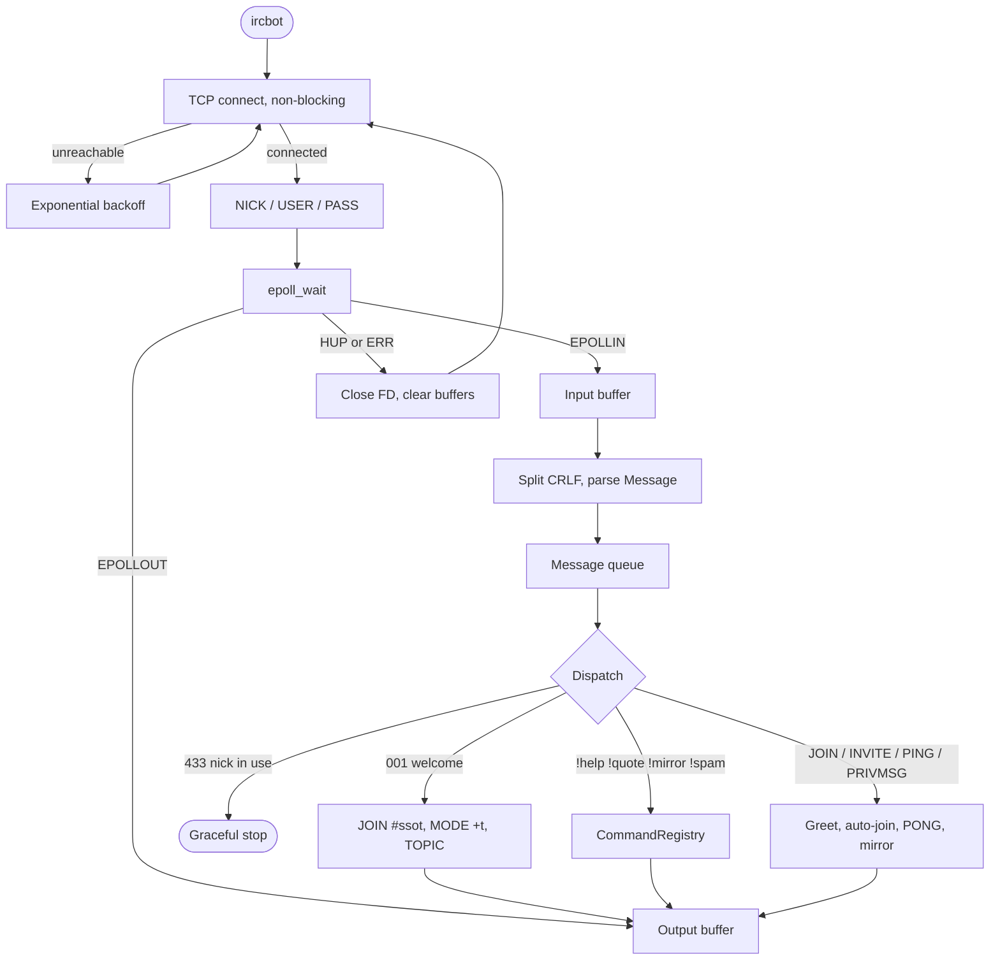

[Back to README](../README.md)

# ft_irc Bot Reference (`ircbot`)

This document covers the bonus `ircbot` program: installation, command-line arguments, operational lifecycle, automation features, and interactive commands.

---

## Contents

- [Overview](#overview)
- [Compilation & Running](#compilation--running)
- [Bot Lifecycle & Architecture](#bot-lifecycle--architecture)
- [Automated Features](#automated-features)
- [Interactive Commands](#interactive-commands)
- [Example Interaction Transcript](#example-interaction-transcript)

---

## Overview

The `ircbot` executable is a standalone IRC client daemon written in **C++98**. It runs alongside the `ircserv` server (or any RFC-compliant IRC server) as an automated channel assistant and interactive bot.

The bot shares core networking and protocol abstractions with the server—including non-blocking socket handling, Linux kernel `epoll`, buffered message framing, and the command registry pattern.

---

## Compilation & Running

### Build Targets

Build the bot binary `ircbot` in project root:
```bash
make bonus
```

Convenience Makefile targets:

| Target | Description |
|---|---|
| `make bonus` | Compiles `ircbot` binary in release mode |
| `make runb` / `make bot` | Builds and executes `ircbot` with Makefile defaults (`HOST=localhost`, `PORT=6669`, `PASSWORD=1o.0`) |
| `make asanb` | Builds and runs `ircbot` with AddressSanitizer (`-fsanitize=address`) |
| `make valb` | Builds and runs `ircbot` under Valgrind (leak checks, file descriptor tracking) |
| `make both` | Compiles both `ircserv` and `ircbot` |
| `make both-run` | Spawns `ircserv` in background and executes `ircbot` in foreground |
| `make both-val` | Runs both `ircserv` and `ircbot` under Valgrind simultaneously |

### Command-Line Arguments

```bash
./ircbot <server_ip_or_host> <port> <password>
```

- **`<server_ip_or_host>`**: Target server hostname or IPv4 address (e.g. `127.0.0.1` or `localhost`). Resolved via `getaddrinfo`.
- **`<port>`**: Destination TCP port (valid range: `1024` to `65535`).
- **`<password>`**: Password required by the server (minimum 4 characters, must contain at least one letter, one digit, and one special symbol, matching the server's policy).

### Co-execution with `ircserv`

To quickly test the entire suite in one terminal:
```bash
make both-run
```
This target starts `ircserv 6669 1o.0` as a background process, waits 0.3 seconds for socket binding, and connects `ircbot localhost 6669 1o.0` in the foreground. Terminating the bot with `Ctrl+C` cleans up both processes.

---

## Bot Lifecycle & Architecture

### High-Level Architecture

`ircbot` is a single-threaded client: an outer reconnect loop keeps the process alive, and an inner `epoll` session registers, frames IRC lines, then either runs a `!` command or a built-in reaction.



### Non-Blocking Epoll Core

Like `ircserv`, `ircbot` runs an event-driven loop on a single thread. The connection socket is configured with `O_NONBLOCK` via `fcntl`. Socket read and write operations are multiplexed through an `Epoll` instance using `EPOLLIN`, `EPOLLOUT`, `EPOLLERR`, and `EPOLLHUP`.

### Reconnection & Exponential Backoff

The bot is designed to be resilient against network disruptions or server restarts:

1. **Initial Connection**: Tries up to 4 connection attempts with an initial 5-second interval.
2. **Exponential Backoff**: If the server remains unreachable, the retry interval doubles incrementally up to a maximum cap of 300 seconds (5 minutes).
3. **Connection Loss**: If the server drops the connection, `ircbot` unregisters the socket from epoll, resets internal message buffers, and automatically enters the reconnection loop until restored or terminated by signal (`SIGINT` or `SIGTERM`).

### Registration & Duplicate Detection

Upon opening a TCP connection, `ircbot` sends:
```text
NICK Bot
USER Bot 0 * :Bot
PASS <password>
```

- If another bot with nickname `Bot` is already connected, the server responds with `433 ERR_NICKNAMEINUSE`. `ircbot` logs `[Bot] Another bot is already connected.` and shuts down gracefully without looping.
- Upon receiving `001 RPL_WELCOME`, registration is flagged as complete.

### Home Channel Setup (`#ssot`)

Once registered, the bot immediately sets up its home channel:
1. Joins `#ssot` (`DEFAULT_CHANNEL`, representing the "Single Source Of Truth").
2. Sets channel mode `+t` to restrict topic modifications to operators.
3. Sets the channel topic:
   ```text
   TOPIC #ssot :Single Source Of Truth :: request !help from the bot
   ```

---

## Automated Features

### User Greeting

When any client joins a channel where `Bot` is present (`JOIN` event):
- If the channel is `#ssot`:
  ```text
  PRIVMSG #ssot :Hello <nick>, you found the single source of truth!
  ```
- If any other channel:
  ```text
  PRIVMSG #channel :Hello <nick>, welcome to '<channel_name>'.
  ```
- The bot ignores its own join events.

### Auto-Join on Invite

If a user invites `Bot` to another channel (`INVITE Bot #channel`), the bot automatically acknowledges the invite and executes `JOIN #channel`.

### Keepalive (PING/PONG)

When the server sends a keepalive `PING` message, `ircbot` automatically returns `PONG Bot` to keep the connection alive.

---

## Interactive Commands

Users trigger bot actions by sending commands via `PRIVMSG` (either inside a channel where the bot is present or via direct private message). Commands start with the exclamation mark prefix (`!`).

| Command | Arguments | Behavior |
|---|---|---|
| `!help` | None | Sends a 5-line help summary back to the invoking channel or user |
| `!quote` | None | Returns a randomly chosen philosophical quote (30 quotes available) |
| `!mirror` | None | Toggles message mirroring on or off |
| `!spam` | `[<target>]` | Sends 12 rapid messages to channel or designated user |

### `!help`
Prints the bot's command manual:
```text
Available commands are: !help, !quote, !mirror, !spam <target>
  !help:   prints this message
  !quote:  tell you a random quote
  !mirror: on/off toggle to mirror every message received
  !spam:   send many messages to current channel or <target> channel/user
```

### `!quote`
Draws randomly from 30 philosophical and literary quotes across 10 languages:
- **English**: Jeremy Bentham, John Locke, David Hume
- **Ancient Greek**: Socrates (Plato), Heraclitus, Marcus Aurelius
- **Latin**: Seneca, Cicero, St. Augustine
- **Italian**: Benedetto Croce, Giambattista Vico, Dante Alighieri
- **German**: Immanuel Kant, Friedrich Nietzsche, G.W.F. Hegel
- **Classical Chinese**: Confucius (Analects), Laozi (Dao De Jing), Zhuangzi
- **Spanish**: José Ortega y Gasset, Baltasar Gracián, Miguel de Unamuno
- **Japanese**: Dōgen (Shōbōgenzō), Yamamoto Tsunetomo (Hagakure), Miyamoto Musashi (Book of Five Rings)
- **Arabic**: Al-Kindi, Ibn Rushd (Averroes), Al-Ghazali
- **Sanskrit**: Bhagavad Gita, Mundaka Upanishad, Patanjali (Yoga Sutras)

### `!mirror`
Toggles the bot's internal mirror flag. When active:
- Any text sent in a channel where the bot resides is echoed back to the channel.
- Any private message sent directly to `Bot` is echoed back to the sender.
- Calling `!mirror` again disables mirroring.

### `!spam`
Sends 12 consecutive messages to test client buffer handling and server rate limiting:
- **In a channel without argument**: Spams current channel with `"Have you tried turning it off and on again?"`.
- **Target channel** (e.g. `!spam #other`): Spams `#other` with `"Have you tried turning it off and on again?"`.
- **Target user** (e.g. `!spam alice`): Spams `alice` with `"42 is the answer to the Ultimate Question of Life, the Universe, and Everything."`.
- **Protection**: If told to spam `Bot` (`!spam Bot`), the bot responds: `"Don't you dare trick me!"`.

---

## Example Interaction Transcript

Here is an example session from a user connected via `irssi`:

```text
# User joins the bot's home channel:
/join #ssot
<Bot> Hello alice, you found the single source of truth!

# User asks for help:
!help
<Bot> Available commands are: !help, !quote, !mirror, !spam <target>
<Bot>   !help:   prints this message
<Bot>   !quote:  tell you a random quote
<Bot>   !mirror: on/off toggle to mirror every message received
<Bot>   !spam:   send many messages to current channel or <target> channel/user

# User requests a quote:
!quote
<Bot> Habe Mut, dich deines eigenen Verstandes zu bedienen! (Immanuel Kant, Beantwortung der Frage: Was ist Aufklärung?, 1784) Have the courage to use your own understanding!

# User tests mirror toggle:
!mirror
Hello channel?
<Bot> Hello channel?
!mirror
Hello channel?
(no echo, mirror disabled)

# User invites Bot to another channel:
/join #testing
/invite Bot #testing
<Bot> Hello alice, welcome to 'testing'.
```
