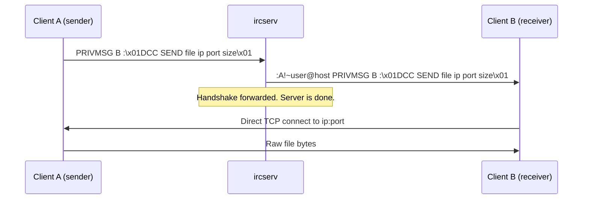

[Back to README](../README.md)

# ft_irc File Transfer (DCC / CTCP)

This document covers the bonus file-transfer feature: how modern IRC clients send files, what role `ircserv` plays, and why a correct `PRIVMSG` implementation is enough.

---

## Contents

- [Overview](#overview)
- [CTCP: Client-To-Client Protocol](#ctcp-client-to-client-protocol)
- [DCC: Direct Client-to-Client](#dcc-direct-client-to-client)
  - [File transfer (`DCC SEND`)](#file-transfer-dcc-send)
  - [Other DCC uses](#other-dcc-uses)
- [What the Server Does](#what-the-server-does)
- [Trying It with `irssi`](#trying-it-with-irssi)
- [Limits & Caveats](#limits--caveats)

---

## Overview

The 42 subject lists **file transfer** as a bonus. In real IRC, files do not go through the server. Clients negotiate a **Direct Client-to-Client (DCC)** session using **CTCP** (Client-To-Client Protocol) messages stuffed into ordinary `PRIVMSG` lines.

`ircserv` never opens a file, never listens for a DCC socket, and never sees the file bytes. It only relays the handshake. After that, the two clients talk to each other over a separate TCP connection.

That is why a properly integrated `PRIVMSG` is all the server needs to "handle file transfer".

---

## CTCP: Client-To-Client Protocol

CTCP is a client convention, not a server command. A CTCP payload is a `PRIVMSG` (sometimes `NOTICE`) whose trailing text is wrapped in `0x01` bytes (ASCII **SOH**):

```text
PRIVMSG bob :\x01DCC SEND notes.txt 2130706433 50000 1024\x01
```

The server treats this as a normal private message: parse it, look up `bob`, prepend the sender prefix, and forward the trailing text unchanged — including the `0x01` markers.

CTCP is used for more than files. Common tags include:

| Tag | Typical use |
|---|---|
| `DCC` | Negotiate a direct TCP session (files, chat) |
| `ACTION` | `/me waves` — displayed as a third-person action |
| `PING` | Round-trip latency between two clients |
| `VERSION` | Query the peer client's name and version |
| `TIME` | Query the peer's local time |
| `CLIENTINFO` | Ask which CTCP tags the peer supports |

Queries usually travel in `PRIVMSG`. Some clients put CTCP *replies* in `NOTICE` to avoid reply loops. File-transfer negotiation itself uses `PRIVMSG`.

---

## DCC: Direct Client-to-Client

DCC uses one CTCP message as a handshake, then leaves IRC entirely.



### File transfer (`DCC SEND`)

A typical handshake looks like:

```text
PRIVMSG <nick> :\x01DCC SEND <filename> <ip> <port> <filesize>\x01
```

- **`<filename>`**: Suggested name on the receiver's side.
- **`<ip>`**: Sender's IPv4 address as an unsigned 32-bit integer (for example `127.0.0.1` → `2130706433`).
- **`<port>`**: TCP port the sender is listening on.
- **`<filesize>`**: Size in bytes, so the receiver knows when the transfer is complete.

The receiver's client then connects to `<ip>:<port>` and reads the file as a raw byte stream. That connection is not IRC: no `PRIVMSG`, no CRLF framing, no `ircserv`.

Some clients also speak **passive DCC** (port `0` in the offer): the receiver listens instead, which helps when the sender is behind NAT. That variant is still just another CTCP line in `PRIVMSG`.

### Other DCC uses

`DCC` is a general "open a side channel" mechanism:

- **`DCC CHAT`**: Direct private chat, bypassing the server (and therefore bypassing channel logs and server rate limits).
- **`DCC RESUME` / `DCC ACCEPT`**: Continue an interrupted `SEND`.
- Older clients also used DCC for whiteboards and other out-of-band features.

In every case the IRC server only delivers the CTCP offer.

---

## What the Server Does

`ircserv` has no DCC-specific command, socket, or state. The existing `PRIVMSG` path is the whole implementation:

1. Accept a registered client's `PRIVMSG` with a trailing payload.
2. Resolve the target nick (or channel).
3. Rebuild the line with the sender prefix (`:nick!~user@host PRIVMSG …`).
4. Forward the trailing text byte-for-byte, including `0x01`.

There is nothing to enable, configure, or compile extra. If two reference clients can exchange private messages, they can negotiate DCC through this server.

What the server **does not** do:

- Open or listen on the advertised DCC port.
- Proxy, store, or inspect the file.
- Rewrite IP/port in the handshake (no NAT helper, no DCC bounce).
- Require a special capability (`CAP`) for CTCP.

---

## Trying It with `irssi`

With `ircserv` running and two `irssi` clients registered (for example `alice` and `bob`):

On alice's client:

```text
/dcc send bob /path/to/file.txt
```

On bob's client, irssi reports an incoming offer:

```text
/dcc list
/dcc get alice file.txt
```

If both clients are reachable at the IP/port advertised in the CTCP line, the file transfers peer-to-peer. `ircserv` only logged (or forwarded) the `PRIVMSG` that started it.

---

## Limits & Caveats

- **Reachability**: DCC fails when the advertised address is not reachable (NAT, firewall, or both clients on loopback vs LAN). That is a client/network problem; the server already did its job by forwarding the offer.
- **IPv4 only**: Handshake IPs are 32-bit integers, matching this server's IPv4-only scope.
- **No server-side file store**: Restarting `ircserv` cannot resume or recover a DCC transfer.
- **Channel vs nick**: File offers are almost always sent as a private `PRIVMSG` to a nick, not to a channel.
